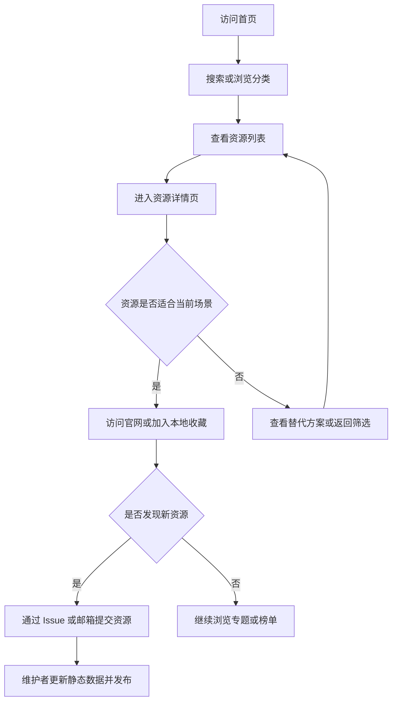

# 开发者资源插件推荐网站 PRD

## 1. 产品概述
本产品是一个面向开发者的资源发现与效率工具推荐网站，聚合开发工具、效率插件、实用网站和学习资源。
- 主要解决开发者找工具慢、判断成本高、资源分散、缺少场景化推荐的问题。
- 产品价值在于用清晰分类、可信推荐、榜单专题和资源详情，帮助开发者快速找到适合当前任务的工具。

## 2. 核心功能

### 2.1 用户角色
| 角色 | 注册方式 | 核心权限 |
|------|----------|----------|
| 访客 | 无需注册 | 浏览首页、分类、专题、榜单和资源详情 |
| 本地收藏用户 | 无需注册，使用浏览器本地存储 | 收藏资源、查看本地收藏、查看最近浏览 |
| 仓库维护者 | GitHub 仓库权限 | 维护静态资源数据、审核 Issue 或 Pull Request、发布专题和榜单 |

### 2.2 功能模块
1. **首页**：品牌定位、全站搜索、热门分类、编辑精选、最新资源、专题榜单。
2. **资源分类页**：按开发工具、效率插件、实用网站、学习资源、AI 工具、设计产品分类浏览。
3. **资源详情页**：展示资源介绍、适用场景、核心亮点、价格平台、替代方案和收藏入口。
4. **专题页**：围绕具体开发场景组织资源合集。
5. **榜单页**：展示热门、最新、评分最高、编辑推荐等资源排行。
6. **提交资源页**：引导用户通过 GitHub Issue、邮箱或说明模板提交工具、插件、网站或开发资源。
7. **个人收藏页**：展示用户收藏、分组和最近浏览。
8. **全局搜索面板**：支持任意页面快速搜索资源、专题、分类和榜单，并提供提交资源、反馈问题等快捷命令。
9. **问题反馈入口**：支持链接失效、信息错误、资源不推荐、新资源推荐和其他建议反馈。

### 2.3 页面详情
| 页面名称 | 模块名称 | 功能描述 |
|----------|----------|----------|
| 首页 | 主视觉区 | 展示网站定位、核心文案、搜索框和主要行动按钮 |
| 全站 | 全局搜索 | 支持 `⌘ K` / `Ctrl K` 打开搜索面板，按名称、标签、推荐理由、适用场景搜索资源 |
| 全站 | 问题反馈 | 顶部导航、资源详情、页脚和空状态中提供反馈入口 |
| 首页 | 热门分类 | 展示资源分类入口和数量统计 |
| 首页 | 编辑精选 | 推荐高质量工具、插件、网站和资源 |
| 首页 | 本周榜单 | 展示近期热门资源排行 |
| 分类页 | 筛选器 | 支持分类、标签、平台、价格、推荐指数筛选 |
| 分类页 | 资源卡片 | 展示名称、简介、标签、推荐理由、收藏按钮 |
| 资源详情页 | 基础信息 | 展示名称、Logo、官网链接、价格、平台和标签 |
| 资源详情页 | 推荐理由 | 说明解决什么问题、适合什么场景、为什么推荐 |
| 资源详情页 | 替代方案 | 展示同类工具和对比入口 |
| 专题页 | 场景合集 | 按开发场景组织资源列表，例如 AI 编程、接口调试、独立开发上线 |
| 榜单页 | 排行列表 | 支持按热度、评分、更新时间、收藏数排序 |
| 提交资源页 | 提交说明 | 展示提交格式、GitHub Issue 预填入口、邮箱或维护方式 |
| 收藏页 | 收藏列表 | 展示浏览器本地收藏资源和最近浏览，支持搜索 |

## 3. 核心流程
用户进入首页后，通过搜索、分类、专题或榜单发现资源；进入详情页判断是否适合当前场景；如果资源有价值，则访问官网或加入本地收藏；用户也可以通过 GitHub Issue 或指定渠道提交新资源，仓库维护者审核后更新静态数据并重新发布。

## 4. 用户界面设计

### 4.1 设计风格
- 风格定位：舒适开发者工具库，结合 GitHub 文档的可信清晰、Raycast 命令面板的轻松高效、VS Code 插件市场的资源卡片结构。
- 主题策略：浅色舒适阅读为主，深色命令面板做记忆点；避免纯黑终端风和赛博朋克强视觉。
- 页面背景：柔和浅灰白 `#F6F8FB`，降低长时间浏览疲劳。
- 主文本：深灰蓝 `#182033`；次级文本使用 `#667085`。
- 主色：稳定蓝 `#2563EB`，用于链接、主按钮、选中状态。
- 强调色：效率绿 `#12B981`，用于推荐、可用状态和精选标识。
- 深色面板：深蓝黑 `#0B1220`，仅用于首页搜索区、命令面板或代码氛围装饰。
- 卡片：白色背景、浅边框、轻阴影，信息清晰，重点突出“推荐理由”。
- 按钮：圆角矩形，主按钮清晰，次按钮克制；不使用过度发光和强渐变。
- 字体：正文优先可读性，代码/快捷键/标签可使用等宽字体增强开发者气质。
- 布局：桌面优先，搜索优先，分类和筛选清楚，资源卡片信息密度适中。
- 动效：轻量、快速、克制，控制在 150-220ms，服务于反馈而不是炫技。

### 4.2 页面设计概览
| 页面名称 | 模块名称 | UI 元素 |
|----------|----------|---------|
| 首页 | 主视觉区 | 大标题、命令面板式搜索框、热门标签、资源统计、低透明度代码氛围 |
| 首页 | 分类入口 | 图标卡片、资源数量、短说明 |
| 首页 | 编辑精选 | 插件市场式资源卡片、推荐理由、收藏按钮 |
| 分类页 | 筛选区 | 标签按钮、下拉筛选、排序选项 |
| 分类页 | 资源列表 | 白底网格卡片、平台徽标、价格标识、评分、推荐理由 |
| 资源详情页 | 信息头部 | Logo、标题、官网按钮、收藏按钮 |
| 资源详情页 | 内容区 | README 式结构、推荐结论、适用场景、替代方案、相关专题 |
| 专题页 | 合集区 | 专题封面、场景说明、资源清单 |
| 榜单页 | 排行区 | 排名数字、趋势标识、热度数据 |
| 收藏页 | 用户资源库 | 分组侧栏、收藏卡片、搜索框 |

### 4.3 响应式
采用桌面优先设计。移动端保留搜索、分类、资源列表、详情阅读和收藏能力；筛选器在移动端收起为抽屉或顶部横向标签。

### 4.4 交互风格
- 总体风格：命令面板式全局搜索 + 插件市场式资源浏览 + GitHub Issue 式反馈协作。
- 全局搜索：所有页面可触达，桌面端支持 `⌘ K` / `Ctrl K`，移动端使用全屏搜索面板。
- 搜索结果：按资源、专题、分类、榜单分组展示，支持关键词高亮和空结果建议。
- 快捷命令：搜索面板支持输入“反馈”“提交”“收藏”“榜单”“专题”等关键词触发快捷动作。
- 资源卡片：默认展示推荐理由、标签、价格、平台、收藏和访问官网；移动端不依赖 hover。
- 收藏：首版使用浏览器 `localStorage`，无需登录，操作后显示轻提示。
- 最近浏览：首版使用 `localStorage` 记录最近 20 条浏览资源。
- 问题反馈：首版通过 GitHub Issue 预填链接或 `mailto:` 实现，不引入后端。
- 状态反馈：收藏、取消收藏、复制链接、清空筛选等操作使用轻提示；空状态必须给出下一步建议。

## 5. 第一阶段范围
- 首页、分类页、资源详情页、专题页、榜单页。
- 使用本地 mock 数据承载资源、分类、专题和榜单。
- 支持全局搜索、分类筛选、排序、本地收藏、最近浏览、问题反馈和提交资源入口。
- 使用 GitHub Pages 部署，暂不实现真实登录、后台审核、评论系统、数据库和支付功能。
