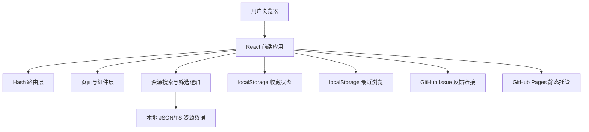

# 开发者资源插件推荐网站技术架构

## 1. 架构设计
首版采用纯静态网站架构，目标是只依赖 GitHub Pages 即可部署访问。网站不需要服务端、不需要数据库、不需要登录系统，所有资源数据随前端代码一起构建发布。



## 2. 技术说明
- 前端：React@18 + TypeScript + Vite
- 样式：Tailwind CSS@3 + CSS 变量
- 路由：React Router，优先使用 `HashRouter`，避免 GitHub Pages 刷新子路径出现 404
- 状态：React 内置状态；收藏、最近浏览等轻量状态使用 `localStorage`
- 数据：本地 `JSON` 或 `TypeScript` 静态数据文件，随代码构建进入静态资源
- 反馈：通过 GitHub Issue 预填链接或 `mailto:` 实现，不依赖后端
- 后端：无
- 数据库：无
- 部署：GitHub Pages
- 构建产物：`npm run build` 生成 `dist/`，由 GitHub Pages 托管

## 3. 路由定义
由于 GitHub Pages 对单页应用的历史路由支持有限，首版使用 Hash 路由。实际访问地址形如 `https://{user}.github.io/{repo}/#/resources`。

| 路由 | 用途 |
|------|------|
| `#/` | 首页，展示搜索、分类、精选资源、专题和榜单 |
| `#/resources` | 资源分类与列表页，支持搜索、筛选和排序 |
| `#/resources/:id` | 资源详情页，展示推荐理由、适用场景、官网链接和替代方案 |
| `#/topics` | 专题列表页 |
| `#/topics/:id` | 专题详情页，展示场景化资源合集 |
| `#/rankings` | 榜单页，展示热门、最新、评分最高资源 |
| `#/submit` | 提交资源页，首版仅展示提交说明或跳转到 GitHub Issue |
| `#/favorites` | 个人收藏页，展示本地收藏资源 |

## 4. 前端模块划分
| 模块 | 职责 |
|------|------|
| `App` | 应用入口、路由配置、全局布局 |
| `Layout` | 顶部导航、页脚、移动端菜单 |
| `GlobalSearch` | 全局搜索面板、快捷命令、搜索结果分组 |
| `HomePage` | 首页主视觉、搜索入口、分类、精选和榜单摘要 |
| `ResourcesPage` | 资源列表、搜索、筛选、排序 |
| `ResourceDetailPage` | 资源详情、适用场景、替代资源 |
| `TopicsPage` | 专题列表 |
| `TopicDetailPage` | 专题资源合集 |
| `RankingsPage` | 榜单展示 |
| `SubmitPage` | 资源提交表单 |
| `FavoritesPage` | 收藏资源展示 |
| `FeedbackEntry` | 反馈入口、Issue 链接构造、反馈类型选择 |
| `components/ui` | 按钮、卡片、标签、输入框、评分、空状态 |
| `data` | 静态分类、资源、专题、榜单数据 |
| `utils` | 搜索、筛选、排序、标签匹配、Issue 链接生成工具函数 |

## 5. 数据模型

```ts
type ResourceCategory =
  | 'dev-tool'
  | 'plugin'
  | 'website'
  | 'learning'
  | 'ai'
  | 'design-product';

type ResourcePricing = 'free' | 'freemium' | 'paid' | 'open-source';

type ResourcePlatform =
  | 'web'
  | 'macos'
  | 'windows'
  | 'linux'
  | 'vscode'
  | 'chrome'
  | 'cli';

type ResourceItem = {
  id: string;
  name: string;
  tagline: string;
  description: string;
  category: ResourceCategory;
  tags: string[];
  url: string;
  logo?: string;
  pricing: ResourcePricing;
  platforms: ResourcePlatform[];
  rating: number;
  popularity: number;
  featured: boolean;
  recommendedReason: string;
  useCases: string[];
  alternatives: string[];
  createdAt: string;
};

type Topic = {
  id: string;
  title: string;
  summary: string;
  coverPrompt?: string;
  resourceIds: string[];
  tags: string[];
};

type Ranking = {
  id: string;
  title: string;
  description: string;
  resourceIds: string[];
};

type SearchCommand = {
  id: string;
  label: string;
  keywords: string[];
  action: 'navigate' | 'open-feedback' | 'open-submit' | 'clear-filters';
  target?: string;
};

type FeedbackType =
  | 'broken-link'
  | 'wrong-info'
  | 'not-recommended'
  | 'suggest-resource'
  | 'other';
```

## 6. 搜索与筛选规则
- 搜索范围：资源名称、简介、标签、推荐理由、适用场景。
- 筛选维度：分类、标签、平台、价格、是否精选。
- 排序维度：推荐指数、评分、热度、更新时间。
- 首版在前端完成过滤和排序，数据量控制在 200 条以内。
- 全局搜索支持资源、专题、分类、榜单和快捷命令混合检索。
- 搜索面板支持 `⌘ K` / `Ctrl K` 打开、`Esc` 关闭、`Enter` 打开选中项。
- 快捷命令支持中文关键词，例如“反馈”“提交”“收藏”“榜单”“专题”。

## 7. 本地状态方案

首版使用浏览器 `localStorage` 存储轻量用户状态。

| Key | 用途 |
|-----|------|
| `devmate:favorites` | 收藏资源 ID 列表 |
| `devmate:recentlyViewed` | 最近浏览资源 ID 和访问时间 |
| `devmate:searchHistory` | 最近搜索关键词，可选 |

约束：
- 收藏和最近浏览不跨设备同步。
- 最近浏览默认保留 20 条。
- localStorage 读取失败时不影响基础浏览能力。
- 提供清空最近浏览的交互入口。

## 8. 反馈与提交方案

首版不实现后端表单。反馈和提交资源通过 GitHub Issue 预填链接完成。

反馈类型：
- 链接失效
- 信息错误
- 资源不推荐
- 推荐新资源
- 其他建议

Issue 链接生成规则：
- 使用 `https://github.com/{owner}/{repo}/issues/new`
- 通过 URL query 传入 `title` 和 `body`
- `title` 和 `body` 必须进行 URL 编码

示例：
```ts
const createIssueUrl = (title: string, body: string) => {
  const params = new URLSearchParams({ title, body });
  return `https://github.com/{owner}/{repo}/issues/new?${params.toString()}`;
};
```

如果暂时没有 GitHub 仓库地址，反馈按钮先跳转到提交说明页，后续再替换为真实 Issue 地址。

## 9. GitHub Pages 部署方案

### 9.1 仓库部署方式
推荐使用 GitHub Actions 自动部署：
1. 代码推送到 `main` 分支。
2. GitHub Actions 执行依赖安装和静态构建。
3. 将 `dist/` 发布到 GitHub Pages。

如果仓库名不是 `{user}.github.io`，Vite 需要配置 `base: '/{repo}/'`，确保静态资源路径在 GitHub Pages 项目站点下可用。

### 9.2 推荐 Vite 配置
```ts
import { defineConfig } from 'vite';
import react from '@vitejs/plugin-react';

export default defineConfig({
  plugins: [react()],
  base: '/dev_mate/',
});
```

如果最终仓库名不是 `dev_mate`，需要把 `base` 改成实际仓库名，例如 `/developer-tools/`。

### 9.3 推荐 GitHub Actions
```yaml
name: Deploy GitHub Pages

on:
  push:
    branches: [main]

permissions:
  contents: read
  pages: write
  id-token: write

concurrency:
  group: pages
  cancel-in-progress: false

jobs:
  build:
    runs-on: ubuntu-latest
    steps:
      - uses: actions/checkout@v4
      - uses: actions/setup-node@v4
        with:
          node-version: 20
          cache: npm
      - run: npm ci
      - run: npm run build
      - uses: actions/upload-pages-artifact@v3
        with:
          path: dist

  deploy:
    environment:
      name: github-pages
      url: ${{ steps.deployment.outputs.page_url }}
    runs-on: ubuntu-latest
    needs: build
    steps:
      - id: deployment
        uses: actions/deploy-pages@v4
```

## 10. 静态数据维护方案
首版资源数据直接维护在代码仓库中，推荐路径：
- `src/data/resources.ts`：资源列表。
- `src/data/categories.ts`：分类定义。
- `src/data/topics.ts`：专题合集。
- `src/data/rankings.ts`：榜单定义。
- `src/data/commands.ts`：全局搜索快捷命令。

资源更新流程：
1. 修改本地资源数据文件。
2. 提交 Pull Request 或直接推送到主分支。
3. GitHub Actions 自动重新构建并发布。
4. GitHub Pages 更新线上内容。

提交资源功能在纯静态方案下不直接写入数据库。首版可采用以下方式之一：
- 跳转到 GitHub Issue，让用户按模板提交资源。
- 提供静态表单说明，让用户通过邮箱或 Issue 提交。
- 后续如需要无后端表单，可接入第三方表单服务，但这不是首版必需项。

## 11. 质量约束
- 资源卡片必须展示“为什么推荐”，避免只有链接。
- 静态数据结构要稳定，便于批量维护和后续扩展。
- 搜索和筛选交互必须快速，空结果要给出明确提示。
- 页面语义化，利于 SEO。
- 移动端资源列表和详情阅读必须可用。
- 不引入必须依赖服务器运行时的功能。
- 不使用需要服务端代理的接口作为核心功能。
- 所有页面刷新后必须能在 GitHub Pages 下正常访问。
- 全局搜索必须在桌面和移动端都可用。
- 反馈和提交资源入口不能依赖后端服务。
